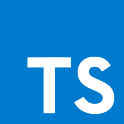

# Arman Ashraf - Software Developer

Welcome to my GitHub profile! I'm Arman Ashraf, a passionate software developer with expertise in frontend and backend technologies. This repository serves as my portfolio, showcasing some of my projects, skills, and interests.

## About Me

I am a dedicated and detail-oriented software developer with a strong foundation in computer science and programming principles. My goal is to leverage my skills and experience to create high-quality software solutions that solve real-world problems and deliver value to users.

## Portfolio

### Projects

Here are some highlights of my projects:

- **[Project 1](https://my-shopping-website-assignment.vercel.app/)**: Intuitive and visually appealing frontend for your eCommerce store..
- **[Project 2](https://weatherinfo24.netlify.app/)**: A compilation of my weather web app projects exemplifying innovation and skill..
- **[Project 3](https://piaicwebtodo.vercel.app/)**:A collection of my web design projects showcasing creativity and expertise..
- **[Project 4](https://bmicalculator-arman.netlify.app/)**:A compilation of my BMI calculator projects exemplifying technical prowess..

For a complete list of my projects, please visit the [Projects](./projects) section.
### Skills

  
  
  
  
  
  
  
  
  
  
  
  
  
  
  

For a detailed overview of my skills, please visit the [Skills](./skills) section.

### Interests

In addition to software development, I am also interested in:

- Open-source contributions
- Continuous learning and professional development
- Exploring new technologies and frameworks

## Contact

- **Email**: [armanashraf015@gmail.com](mailto:armanashraf015@gmail.com)
- **LinkedIn**: [Arman Ashraf](https://www.linkedin.com/in/arman-ashraf-427951219/)
- **GitHub**: [arman229](https://github.com/arman229)
- **Portfolio**: [portfolio](https://armanashrafportfolio.vercel.app/)
- **CV**: <a href="./mycv/arman_cv.pdf" download>Download CV</a>

Feel free to reach out to me via email or connect with me on LinkedIn. I'm always open to new opportunities, collaborations, and discussions.
 